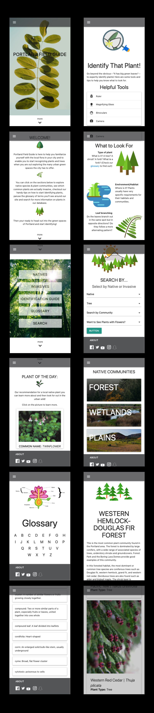

# Portland Field Guide

## By: **_Stuart Mckay, Reese Lee, Brooke Kullberg, Megan Schulte, AJ Ancheta_**

#### _JavaScript, Week 5 Independent Project, *06.27.2019*_

## Description

_This is a web application that allows users to search local native and invasive plants in Portland, OR. This app was inspired by the love of plants and the desire to know them better. It is very satisfying to be out on a hike, in city you love, and be able to recognize the plants around you. As such, this app was designed and optimized for use on a phone, acting as a digital field guide. Thus, this app is for the people and visitors of Portland, OR!_ 

_Beyond searching for plants and their detailed information, this app gives educational pointers about how to identify plants and provides a glossary of related terms. The user can learn about the various plant communities of the region, and see the plants related to those communities. The user can also learn about invasive plants, why they are detrimental to the native habitats, and their different rankings._

_The database and plant information was derrived from "Portland Plant List" (June 2016: `https://www.portlandoregon.gov/citycode/article/322280`). The database is currently not complete! We are continuing to work on this project when time allows. Please enjoy!_

## Technologies Used

- Angular Version 5.2.0
- Typescript Version 2.5.3
- Firebase Database 3.9.0

## Setup Instructions for accessing the Application

#### To view project file

- Clone this GitHub repository "https://github.com/meganschultepdx/Portland-field-guide.git" to your desktop.
- Open the repository in a preferred text editor such as Atom or Visual Studio Code.

#### To run the application

* As the apiKey for the Firebase database is ignored, the user must create their own app on [Firebase](https://firebase.google.com/). 
* Once the app is created, add a realtime database and upload database.json located in this project at `./src/app/database.json`.
* Next, navigate to the account `Project Overview` of the app and scroll down to `Firebase SDK snippet`, and select `Config`
*  Creat the file `./src/app/api-keys.ts`, within it write `export const masterFirebaseConfig = {}` and within the curly braces, copy the script from the firebase `Config`.  
* Navigate to your machine's terminal and enter the following commands within the main project directory:

`npm install` This will allow the viewer of this project to have access to the CLI (command line interface) for webpack.

`ng serve` in the project directory in Terminal. Go to http://localhost:4200/ in the browser of your choice. Note: The app will automatically reload if you change any of the source files. This is a continuous monitoring so to stop it just type the key combination `Ctrl + C` within the terminal.

## Screenshots of a few screens from the project

## Resources

_Portland Plant List, June 2016: `https://www.portlandoregon.gov/citycode/article/322280`._
_Custom icons by Ashley using `www.figma.com`._

## Known Bugs

There are no known bugs.

## Support and contact details

Megan Schulte: megan.schulte.pdx@gmail.com
Brooke Kullberg: brookekullberg@gmail.com
Ashley Ancheta: ashleyjancheta@gmail.com
Stuart McKay: ashleyjancheta@gmail.com
Reese Lee: ashleyjancheta@gmail.com

Copyright (c) 2019 **_Stuart Mckay, Reese Lee, Brooke Kullberg, Megan Sculte, AJ Ancheta_**
